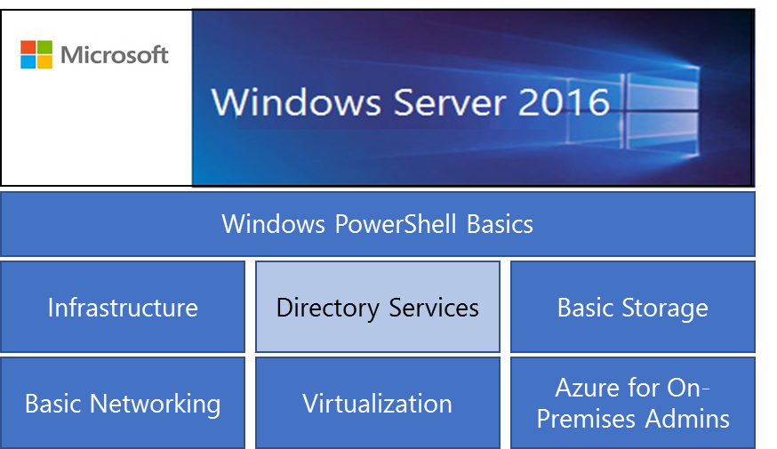

<h2>About this XSeries</h2>

This XSeries consists of six courses. You can take the courses in any order. An optional Windows PowerShell Basics course is also provided if you need some additional help in getting up to speed in PowerShell.

This course is designed to get you started as quickly as possible. There are a variety of self-paced learning activities.

<ul>
<li><strong>Review Questions</strong> are located at the end of each module and check your general understanding of the key concepts.</li>
<li><strong>Practical Exercises</strong> are hands-on tasks that demonstrate what you have learned in the course.</li>
<li><strong>Videos <strong>and</strong> Demonstrations</strong> are located throughout the course to explain the concepts and provide system walk-throughs.</li>
<li><strong>Graded Lab:</strong> in addition to the practical exercises, there is a final scored lab that will contribute to your overall course grade.</li>
<li><strong>Final Exam:</strong> The Final Exam questions are scored, check your understanding of the key concepts in the course, and are combined with your graded lab score for a final grade.</li>
</ul>

<strong>Feedback</strong>

All questions, comments, feedback, and ideas are welcome.

Good luck!

<strong>Windows Server 2016 Courseware Team</strong>
k_n^2
\Pi

